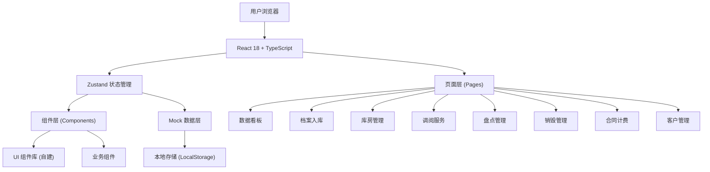
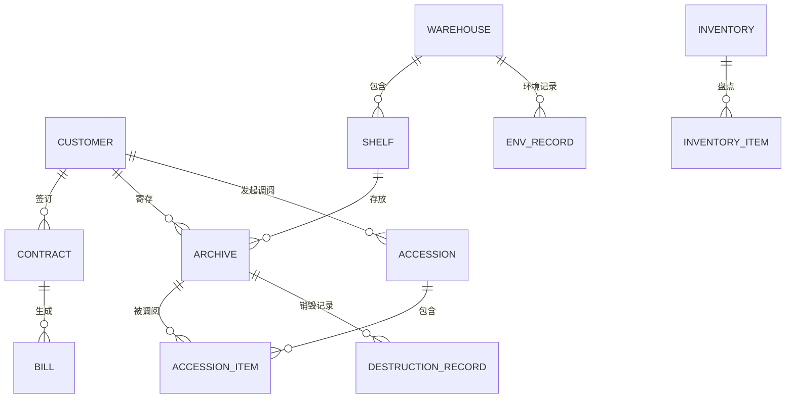

## 1. 架构设计



## 2. 技术描述
- **前端框架**：React@18 + TypeScript@5.8
- **构建工具**：Vite@6.3
- **样式方案**：TailwindCSS@3.4 + CSS Variables
- **状态管理**：Zustand@5.0（集中式状态管理，支持持久化）
- **路由管理**：React Router DOM@7.3
- **图标库**：Lucide React
- **工具函数**：clsx + tailwind-merge（类名合并）
- **数据方案**：前端 Mock 数据 + LocalStorage 持久化（无需后端）
- **图表方案**：纯 CSS + SVG 实现简单图表（避免引入额外依赖）

## 3. 路由定义
| 路由路径 | 页面组件 | 用途 |
|---------|---------|------|
| / | Dashboard | 数据看板总览 |
| /dashboard | Dashboard | 数据看板总览 |
| /archives | ArchiveList | 档案列表与入库管理 |
| /archives/new | ArchiveNew | 新增档案入库登记 |
| /warehouses | WarehouseList | 库房列表总览 |
| /warehouses/:id | WarehouseDetail | 库房详情与架位管理 |
| /warehouses/:id/environment | EnvironmentMonitor | 温湿度监控 |
| /accessions | AccessionList | 调阅申请列表 |
| /accessions/new | AccessionNew | 新建调阅申请 |
| /inventory | InventoryList | 盘点任务列表 |
| /inventory/:id | InventoryExecute | 盘点执行 |
| /destruction | DestructionList | 到期与销毁管理 |
| /contracts | ContractList | 合同管理 |
| /billing | BillingList | 账单管理 |
| /customers | CustomerList | 客户管理 |
| /customers/:id | CustomerDetail | 客户详情 |

## 4. 数据模型

### 4.1 实体关系图



### 4.2 TypeScript 类型定义

```typescript
// 客户
interface Customer {
  id: string;
  name: string;
  contactPerson: string;
  contactPhone: string;
  address: string;
  createdAt: string;
  archiveCount: number;
  accessCount: number;
}

// 合同
interface Contract {
  id: string;
  customerId: string;
  customerName: string;
  contractNo: string;
  startDate: string;
  endDate: string;
  maxBoxes: number;
  feePerBox: number;
  feePerVolume: number;
  feePerWeight: number;
  accessFeePerTime: number;
  status: 'active' | 'expired' | 'terminated';
}

// 库房
interface Warehouse {
  id: string;
  name: string;
  code: string;
  archiveType: 'paper' | 'film' | 'mixed';
  totalPositions: number;
  usedPositions: number;
  columns: number;
  sidesPerColumn: number;
  levelsPerSide: number;
  status: 'normal' | 'warning' | 'full';
}

// 架位 (四级: 库房-列-面-层)
interface ShelfPosition {
  id: string;
  warehouseId: string;
  warehouseName: string;
  column: number;
  side: number;
  level: number;
  code: string;
  occupied: boolean;
  archiveId?: string;
}

// 档案
interface Archive {
  id: string;
  barcode: string;
  customerId: string;
  customerName: string;
  type: 'finance' | 'personnel' | 'contract' | 'engineering' | 'medical' | 'other';
  typeName: string;
  title: string;
  boxNo: string;
  volume: number;
  weight: number;
  retentionPeriod: 'permanent' | '30years' | '10years' | '5years' | 'custom';
  retentionYears?: number;
  storageDate: string;
  expiryDate: string;
  positionId?: string;
  positionCode?: string;
  warehouseId?: string;
  status: 'in_stock' | 'out_reading' | 'out_borrowed' | 'inventory' | 'destroyed' | 'pending_destroy';
  metadata: Record<string, string>;
}

// 温湿度记录
interface EnvironmentRecord {
  id: string;
  warehouseId: string;
  warehouseName: string;
  recordDate: string;
  temperature: number;
  humidity: number;
  isAbnormal: boolean;
  riskLevel: 'low' | 'medium' | 'high';
}

// 调阅申请
interface Accession {
  id: string;
  accessionNo: string;
  customerId: string;
  customerName: string;
  applicant: string;
  purpose: 'audit' | 'litigation' | 'reference' | 'copy' | 'borrow';
  purposeName: string;
  durationDays: number;
  startTime: string;
  expectedReturnDate: string;
  actualReturnDate?: string;
  status: 'pending' | 'approved' | 'rejected' | 'outbound' | 'in_reading' | 'returned' | 'overdue';
  items: AccessionItem[];
  createdAt: string;
}

interface AccessionItem {
  id: string;
  accessionId: string;
  archiveId: string;
  barcode: string;
  title: string;
  boxNo: string;
  outboundTime?: string;
  readingConfirmTime?: string;
  returnTime?: string;
  returnStatus: 'normal' | 'damaged' | 'missing';
}

// 盘点任务
interface InventoryTask {
  id: string;
  taskNo: string;
  name: string;
  type: 'by_warehouse' | 'by_customer' | 'by_position';
  scope: Record<string, string>;
  totalCount: number;
  checkedCount: number;
  normalCount: number;
  missingCount: number;
  misplacedCount: number;
  damagedCount: number;
  status: 'pending' | 'in_progress' | 'completed';
  createdAt: string;
  startedAt?: string;
  completedAt?: string;
}

interface InventoryItem {
  id: string;
  taskId: string;
  archiveId: string;
  barcode: string;
  title: string;
  expectedPosition: string;
  actualPosition?: string;
  status: 'pending' | 'normal' | 'missing' | 'misplaced' | 'damaged';
  checkedAt?: string;
}

// 销毁记录
interface DestructionRecord {
  id: string;
  archiveId: string;
  barcode: string;
  title: string;
  customerId: string;
  customerName: string;
  applyDate: string;
  customerApproved: boolean;
  customerApprover?: string;
  customerApproveDate?: string;
  managerApproved: boolean;
  managerApprover?: string;
  managerApproveDate?: string;
  executeDate?: string;
  destroyMethod: 'shred' | 'burn' | 'pulping' | 'other';
  supervisor: string;
  status: 'pending_customer' | 'pending_manager' | 'approved' | 'executed' | 'rejected';
  metadataSummary: Record<string, string>;
}

// 账单
interface Bill {
  id: string;
  billNo: string;
  contractId: string;
  customerId: string;
  customerName: string;
  period: string;
  storageFee: number;
  accessFee: number;
  totalAmount: number;
  status: 'pending' | 'issued' | 'paid' | 'overdue';
  issueDate: string;
  dueDate: string;
  paidDate?: string;
}
```

## 5. 项目结构

```
src/
├── components/           # 通用组件
│   ├── Layout/          # 布局组件 (Sidebar, Header, Layout)
│   ├── UI/              # 基础 UI 组件 (Button, Card, Badge, Modal, Table, Form)
│   ├── Charts/          # 图表组件 (LineChart, BarChart, ProgressRing)
│   └── features/        # 业务组件 (各模块复用组件)
├── pages/               # 页面组件
│   ├── Dashboard.tsx
│   ├── archives/
│   ├── warehouses/
│   ├── accessions/
│   ├── inventory/
│   ├── destruction/
│   ├── contracts/
│   ├── billing/
│   └── customers/
├── store/               # Zustand 状态管理
│   ├── index.ts
│   ├── customerStore.ts
│   ├── archiveStore.ts
│   ├── warehouseStore.ts
│   ├── accessionStore.ts
│   ├── inventoryStore.ts
│   ├── destructionStore.ts
│   └── billingStore.ts
├── types/               # TypeScript 类型定义
│   └── index.ts
├── data/                # Mock 数据
│   └── mockData.ts
├── lib/                 # 工具函数
│   └── utils.ts
├── hooks/               # 自定义 Hooks
│   └── useTheme.ts
├── App.tsx
├── main.tsx
└── index.css
```

## 6. 状态管理设计

使用 Zustand 创建模块化 Store，每个业务域独立 Store，通过主 Store 统一导出。

```typescript
// store/index.ts
import { create } from 'zustand';
import { persist } from 'zustand/middleware';
import type { AppState } from '@/types';

export const useAppStore = create<AppState>()(
  persist(
    (set, get) => ({
      // ... 所有状态与 actions
    }),
    { name: 'archive-management-storage' }
  )
);
```
