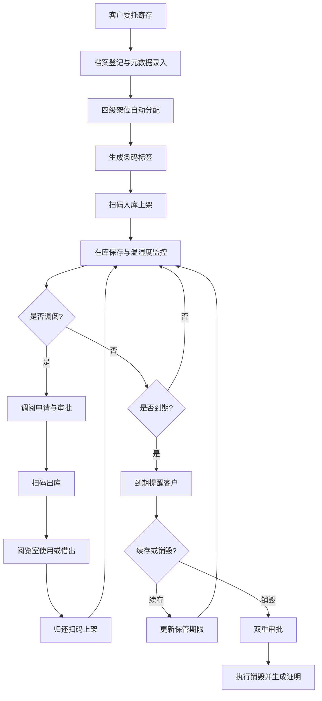

## 1. 产品概述

独立档案馆寄存中心库房管理与调阅服务系统，面向档案寄存中心的全生命周期管理需求，涵盖从档案入库、库房管理、调阅服务、盘点、销毁到合同计费的完整业务流程。目标用户为档案管理员、库房管理人员和客户服务人员，旨在实现档案管理的数字化、规范化和智能化。

- 主要解决纸质/胶片档案的入库登记、架位分配、环境监控、调阅跟踪、盘点核查、到期销毁等核心痛点
- 产品价值：提升档案管理效率，降低人工差错率，保障档案保存安全，实现业务流程可追溯

## 2. 核心功能

### 2.1 用户角色
| 角色 | 注册方式 | 核心权限 |
|------|---------|---------|
| 系统管理员 | 系统内置 | 全功能访问、用户管理、系统配置 |
| 库房管理员 | 管理员创建 | 档案入库、库房管理、温湿度记录、盘点执行 |
| 调阅管理员 | 管理员创建 | 调阅申请审批、出入库扫码、归还登记 |
| 客户服务 | 管理员创建 | 客户管理、合同管理、账单生成、销毁审批 |

### 2.2 功能模块
1. **数据看板 (Dashboard)**：在库总量统计、库房容量使用率、当日出入库、逾期未还、到期续存/销毁、环境告警趋势
2. **档案入库管理**：档案登记（类型、元数据、保管期限）、架位自动分配、条码标签生成
3. **库房管理**：库房-列-面-层四级架位、容量监控与满架预警、温湿度记录与告警、风险评估
4. **调阅服务**：调阅申请、用途登记、扫码出库、阅览室确认、借出归还提醒、归还扫码上架
5. **盘点管理**：盘点任务创建、扫码核查、差异报告生成、移库调整
6. **销毁管理**：到期提醒、续存确认、双重审批、销毁执行记录、销毁证明
7. **合同与计费**：客户合同管理、费用标准配置、月度账单生成、调阅服务计费
8. **客户管理**：客户信息管理、寄存量统计、调阅频次统计

### 2.3 页面详情
| 页面名称 | 模块名称 | 功能描述 |
|---------|---------|---------|
| 数据看板 | 统计概览 | 在库总盒数、各库房容量使用率、当日调阅出入库与归还数 |
| 数据看板 | 预警提醒 | 逾期未还清单、到期续存与销毁列表、环境异常告警趋势 |
| 数据看板 | 客户维度 | 寄存量与调阅频次统计 |
| 档案入库 | 档案登记 | 按类型登记元数据、保管期限、客户信息 |
| 档案入库 | 架位分配 | 库房-列-面-层四级架位自动分配、手工调整 |
| 档案入库 | 条码管理 | 唯一条码生成、标签预览与打印 |
| 库房管理 | 架位总览 | 库房布局可视化、容量使用率实时展示、满架预警 |
| 库房管理 | 温湿度监控 | 每日读数记录、标准范围校验、异常告警、月度波动曲线 |
| 调阅服务 | 申请管理 | 调阅申请创建、按盒号/类型检索、用途与时长登记 |
| 调阅服务 | 出入库 | 扫码出库、阅览室确认、借出到期提醒、归还扫码上架 |
| 盘点管理 | 任务管理 | 按库房/客户/架位创建盘点任务、生成清单 |
| 盘点管理 | 执行盘点 | 逐盒扫码、缺失/错位/破损标记、差异报告 |
| 销毁管理 | 到期管理 | 到期自动提醒、客户续存确认 |
| 销毁管理 | 销毁审批 | 客户与主管双重审批流程 |
| 销毁管理 | 销毁执行 | 销毁方式/日期/监销人记录、销毁证明生成 |
| 合同计费 | 合同管理 | 起止日期、寄存上限、费用标准（按盒/体积/重量） |
| 合同计费 | 账单管理 | 月度自动生成寄存费账单、到期提醒、调阅服务计费 |
| 客户管理 | 客户档案 | 客户基本信息、联系人、寄存量与调阅频次统计 |

## 3. 核心流程

**档案入库流程**：客户委托 → 管理员登记档案类型与元数据 → 系统按四级架位自动分配位置 → 生成唯一条码标签 → 打印粘贴 → 扫码上架确认

**调阅服务流程**：客户发起调阅申请 → 指定盒号或按类型检索 → 填写用途与时长 → 管理员审批 → 扫码出库 → 阅览室扫描确认（或借出馆外）→ 到期自动提醒 → 归还完整性检查 → 扫码上架

**盘点流程**：创建盘点任务（按库房/客户/架位范围）→ 生成盘点清单 → 逐盒扫码确认在位 → 标记缺失/错位/破损 → 生成差异报告 → 移库调整更新坐标

**销毁流程**：系统到期前提醒 → 客户确认续存或销毁 → 销毁申请 → 客户与主管双重审批 → 执行销毁（记录方式/日期/监销人）→ 生成销毁证明 → 保留元数据摘要备查

## 4. 用户界面设计

### 4.1 设计风格
- **主色调**：深蓝 (#1e3a5f) 作为主色，代表专业、可信赖；暖金 (#c9a962) 作为辅助色，代表档案的历史厚重感
- **中性色**：以 slate/zinc 系列灰色为基础，构建层次分明的界面
- **按钮风格**：圆角 6px，实心按钮配阴影，悬停时微微上浮
- **字体**：标题使用 "Noto Serif SC" 衬线字体体现档案气质，正文使用 "Noto Sans SC" 无衬线保证可读性
- **布局风格**：左侧固定侧边栏导航 + 顶部状态栏 + 主内容区卡片式布局
- **图标风格**：使用 lucide-react 线性图标，保持简洁统一

### 4.2 页面设计概览
| 页面名称 | 模块名称 | UI元素 |
|---------|---------|--------|
| 数据看板 | 统计概览 | 4张统计卡片（在库盒数、容量使用率、今日出入库、待处理告警），渐变背景配大数字 |
| 数据看板 | 图表区域 | 温湿度月度曲线图（面积图）、库房容量柱状图、客户寄存量Top10条形图 |
| 数据看板 | 列表区域 | 逾期未还清单、到期续存/销毁列表，带状态标签和操作按钮 |
| 档案入库 | 登记表单 | 分组表单（基本信息、元数据、保管信息），下拉选择、日期选择器、文本域 |
| 档案入库 | 架位预览 | 四级架位可视化展示（库房→列→面→层），高亮已分配位置 |
| 库房管理 | 库房总览 | 卡片式库房列表，显示容量进度条和状态指示灯，点击进入详情 |
| 库房管理 | 温湿度详情 | 表格展示每日记录，超阈值行高亮，折线图展示波动趋势 |
| 调阅服务 | 申请列表 | 数据表格，状态筛选标签，行内快捷操作按钮 |
| 盘点管理 | 任务卡片 | 进度环显示盘点完成率，状态徽章（待开始/进行中/已完成） |
| 通用组件 | 侧栏导航 | 可折叠侧栏，图标+文字，当前页高亮，底部显示用户信息 |
| 通用组件 | 顶部栏 | 面包屑导航、搜索框、通知铃铛、用户头像下拉 |

### 4.3 响应式
- 桌面端优先设计（1440px基准）
- 1024px以下侧栏折叠为图标模式
- 768px以下表格转卡片视图，顶部操作栏折行

### 4.4 动效设计
- 页面加载：卡片依次淡入上浮（stagger 80ms）
- 数据更新：数字滚动动画
- 悬停反馈：按钮/卡片轻微上浮 + 阴影加深
- 状态切换：平滑过渡 200ms ease-out
